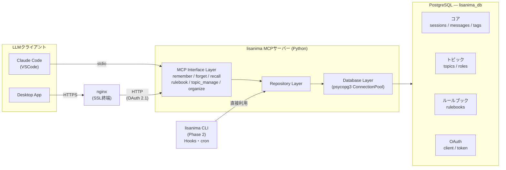

# アーキテクチャ設計: lisanima

## 1. システム構成図



> ※ 本図はPhase 2完成予定図。現在の実装状況は各ドキュメントを参照。

### アクセス経路の使い分け

| 経路 | トリガー | 用途 |
|------|---------|------|
| MCPサーバー | LLM（リサ）が自発的に判断 | 対話中のremember/forget/recall/rulebook/topic_manage/organize |
| CLI | Hooks・cron等の機械的イベント | セッション開始時の自動recall、終了時の自動remember |

MCPサーバーとCLIはRepository/Database Layerを共有し、同一DBにアクセスする。

→ スキーマ詳細: [04_schema.md](04_schema.md)

## 2. 技術選定

| コンポーネント | 技術 | 選定理由 |
|--------------|------|---------|
| 言語 | Python 3.12+ | MCP SDK公式対応、チームの習熟度 |
| パッケージ管理 | uv | pip比で10-100倍高速、ロックファイル対応 |
| MCPフレームワーク | FastMCP（`mcp` Python SDK内蔵） | 公式SDK、stdio/Streamable HTTP対応、OAuth 2.0 AS内蔵 |
| DB | PostgreSQL | crypto_trade_botと同一インスタンス活用、全文検索が強力 |
| DB接続 | psycopg3 | asyncio対応、コネクションプール内蔵 |
| 全文検索 | pg_trgm + GINインデックス | 日本語トライグラム検索、追加拡張不要 |
| ルール同期 | 自作（未実装） | ルールブックDB → CLAUDE.md / GEMINI.md 生成（Phase 4.0） |

### SQLite を採用しなかった理由
- crypto_trade_botで既にPostgreSQLが稼働中（インフラ追加コストゼロ）
- pg_trgmによる日本語全文検索がSQLite FTS5より設定が容易
- 将来的にリモートアクセス（複数マシンからリサの記憶を参照）の可能性

## 3. ディレクトリ構成

```
lisanima/
├── docs/                設計ドキュメント
├── migrations/          マイグレーションSQL
├── src/lisanima/
│   ├── server.py        MCPサーバーエントリポイント
│   ├── db.py            DB接続・コネクションプール
│   ├── auth/            OAuth 2.1認証
│   ├── repositories/    ビジネスロジック・SQL発行
│   └── interface/       MCPコマンド定義（旧 tools/）
├── sql/                 DDL
├── tests/
└── pyproject.toml
```

## 4. レイヤー設計

### 4.1 MCP Interface Layer
- MCPプロトコルのコマンド定義
- 入力バリデーション
- Repository Layerの呼び出し
- LLMに返すレスポンスの整形

→ 詳細: [03_mcp_interface.md](03_mcp_interface.md)

### 4.2 Repository Layer
- ビジネスロジック（検索条件の組み立て、感情値の計算等）
- SQLの発行はここに集約
- 1リポジトリ = 1テーブル（+ 関連テーブル）
- MCPクライアント識別（source tracking）の記録もこのレイヤーで行う

### 4.3 Database Layer
- psycopg3のコネクションプール管理（`AsyncDatabasePool`）
- DB接続情報の読み込み（.env）
- トランザクション制御
- `get_connection()` は `@asynccontextmanager` + lazy init パターン。OAuth認証フローなどMCPセッション確立前のリクエストにも対応

→ Markdownデータ移行: [90_markdown_migration.md](90_markdown_migration.md)
→ スキーママイグレーション戦略: [05_schema_migration.md](05_schema_migration.md)

## 5. 通信方式

### 5.1 MCP Protocol（stdio）
- Claude Code / Gemini CLI → lisanima MCPサーバー間の通信
- JSON-RPC 2.0ベース
- ネットワークを介さないローカル通信（セキュリティリスク最小）

```
LLMクライアント  --stdin-->  lisanima MCPサーバー
                <--stdout--
```

### 5.2 Streamable HTTP（リモート接続）
- Desktop App等のリモートクライアント → nginx → lisanima MCPサーバー
- OAuth 2.1認証（PIN方式）実装済み。詳細: [07_oauth.md](07_oauth.md)
- systemdサービス `lisanima.service` で `--http` モード稼働中

```
Desktop App  --HTTPS-->  nginx (SSL終端)  --HTTP-->  lisanima (127.0.0.1:8765)
                         /lisanima/                  → /
```

| 項目 | 値 |
|------|-----|
| MCPエンドポイント | `https://<your-domain>/lisanima/mcp` |
| issuer_url | `https://<your-domain>`（パスなし。3/26 auth specの要件） |
| resource_server_url | `https://<your-domain>/lisanima/mcp` |
| nginxプロキシ | `/lisanima/` → `http://127.0.0.1:8765/` |
| 認証 | OAuth 2.1（PIN方式） |

### Claude Code側の設定（ユーザーレベル）

プロジェクト横断で使うため、ユーザーレベル（`~/.claude.json`）に登録する。

```bash
claude mcp add --scope user lisanima -- uv run --directory /home/natosepia/project/lisanima python -m lisanima.server
```

### Desktop App側の設定

1. 設定 > コネクタ > 「カスタムコネクタを追加」
2. MCPサーバーURLに `https://<your-domain>/lisanima/mcp` を入力
3. OAuth認証フロー（PIN入力）を完了して接続

## 6. セキュリティ設計

- **stdioモード**: ローカルサブプロセス通信のため認証不要（UNIXプロセス間通信のセキュリティに依存）
- **HTTPモード**: OAuth 2.1認証を実装。PIN方式による認可フロー

セキュリティの詳細は [06_security.md](06_security.md)、認証プロトコルは [07_oauth.md](07_oauth.md) を参照。

## 7. ログ戦略

- **出力先**: stderr（MCPプロトコルがstdin/stdoutを占有するため）
- **本番運用**: systemd journalで永続化
→ 詳細: [08_logging.md](08_logging.md)

## 8. トランザクション設計

- psycopg3の `async with conn.transaction()` を利用
- MCPコマンド1回 = トランザクション1つ（原子性の単位）
- 分離レベル: READ COMMITTED（PostgreSQLデフォルト）
- 単一PostgreSQLインスタンスのため分散トランザクション不要

→ 詳細: [09_transaction.md](09_transaction.md)

## 9. 実装詳細図

- **クラス図**: [10_class_diagram.md](10_class_diagram.md) — Pythonコードのクラス構造・レイヤー間の依存関係
- **シーケンス図**: [11_sequence_diagram.md](11_sequence_diagram.md) — remember / recall / OAuth認証の処理フロー

## 10. テスト・デプロイ・運用

- **テスト戦略**: [12_testing.md](12_testing.md)
- **デプロイ手順**: [31_deployment.md](31_deployment.md) — ゼロからlisanimaを動かすまで
- **オペレーション**: [32_operation.md](32_operation.md) — 定型/非定型の運用手順書

## 11. 将来の拡張ポイント

| 拡張 | 概要 | 想定Phase |
|------|------|----------|
| lisanima CLI | Hooks・cronからDB操作するためのコマンドラインI/F | Phase 2.0 |
| Hooks連携 | セッション開始時の自動recall、終了時の自動remember | Phase 2.0 |
| 能動的発話 | emotion + 未完了トピック検出によるリサ起点の発話 | Phase 2.0 |
| メンタル管理 | 外的・内的要因によるコンディション表現 | Phase 3.0 |
| ルール同期 | ルールブックDB → CLAUDE.md / GEMINI.md 自動生成 | Phase 4.0 |
| 埋め込みベクトル | 意味検索（セマンティック検索）の追加 | Phase 3.0 |
| Web UI | 記憶の閲覧・編集用ダッシュボード | Phase 3.0 |
| マルチユーザー | 複数AI人格の記憶管理 | Phase 4.0 |
