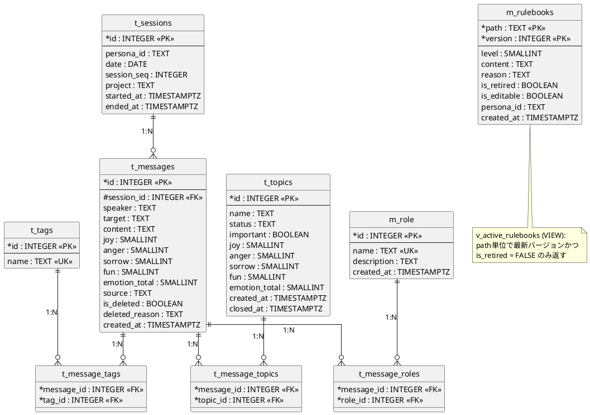
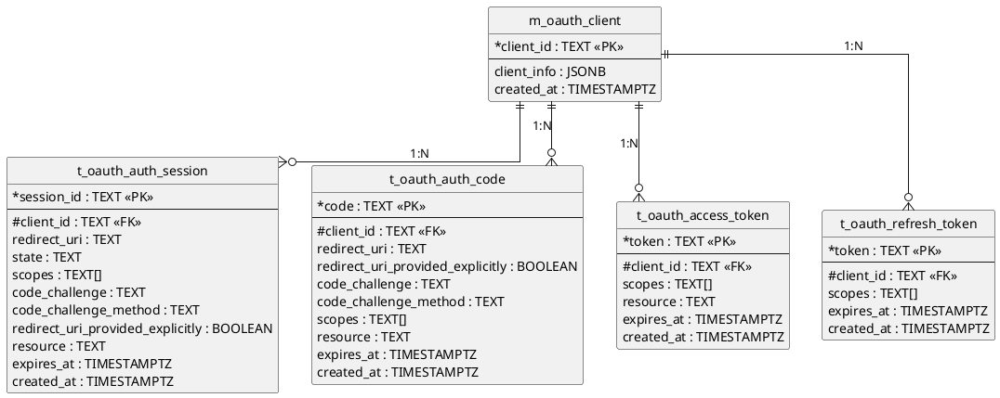

# DBスキーマ設計: lisanima

## 1. 概要

- **DB**: PostgreSQL（既存インスタンスに `lisanima_db` データベースを作成）
- **全文検索**: pg_trgm拡張 + GINインデックス
- **文字コード**: UTF-8
- **設計方針**: MCPコマンド（外部設計: [03_mcp_interface.md](03_mcp_interface.md)）から必要なテーブルを導出する

### 命名規約

| プレフィックス | 分類 | 用途 |
|---------------|------|------|
| t_ | トランザクション | 頻繁に更新されるデータ |
| m_ | マスタ | 参照中心の定義データ |
| v_ | ビュー | 導出データ |

## 2. ER図

> mermaid erDiagramは同一エンティティを複数ブロックに分割すると暗黙のリレーション線を描画する問題があるため、PlantUMLで記述する。

### 記憶管理（t_messages中心モデル）

### OAuth 2.1

## 3. テーブル定義

### 3.1 t_sessions（セッション）

なとせ⇔リサの会話セッション単位。1日に複数セッションが存在しうる。

| カラム | 型 | 制約 | 説明 |
|--------|-----|------|------|
| id | INTEGER | PK, GENERATED ALWAYS AS IDENTITY | セッションID |
| persona_id | TEXT | NOT NULL, DEFAULT 'lisa' | 人格識別子（将来のマルチ人格拡張用） |
| date | DATE | NOT NULL | セッション日付 |
| session_seq | INTEGER | NOT NULL, DEFAULT 1 | 同日内の連番 |
| project | TEXT | NULLABLE | プロジェクト名（横断時はNULL） |
| started_at | TIMESTAMPTZ | NOT NULL, DEFAULT NOW() | 開始日時 |
| ended_at | TIMESTAMPTZ | NULLABLE | 終了日時 |

**制約:**
- `UNIQUE(persona_id, date, session_seq)` -- マルチペルソナ対応

**persona_id について:**
- Phase 1 ではリサ1人の人格管理基盤のため、常に `'lisa'` 固定
- 将来マルチ人格対応が必要になった場合の拡張余地として用意
- 将来 m_persona マスタ作成時にFK化予定

**ended_at の更新タイミング:**
- なとせの「おやすみ」「おわるか」等のセッション終了発言を検知した際にリサが更新
- 次回セッション開始時に前回セッションのended_atがNULLなら、前回最終メッセージのcreated_atで補完

### 3.2 t_messages（発言）

発言単位の記録。感情ベクトル・論理削除フラグを含む。

| カラム | 型 | 制約 | 説明 |
|--------|-----|------|------|
| id | INTEGER | PK, GENERATED ALWAYS AS IDENTITY | メッセージID |
| session_id | INTEGER | FK → t_sessions.id, NOT NULL | 所属セッション |
| speaker | TEXT | NOT NULL | 発言者（CHECK制約なし。後述） |
| target | TEXT | NOT NULL, DEFAULT '*' | 発言先（'*' は全員向けブロードキャスト） |
| content | TEXT | NOT NULL | 発言内容 |
| joy | SMALLINT | NOT NULL, DEFAULT 0, CHECK (0-255) | 喜び |
| anger | SMALLINT | NOT NULL, DEFAULT 0, CHECK (0-255) | 怒り |
| sorrow | SMALLINT | NOT NULL, DEFAULT 0, CHECK (0-255) | 哀しみ |
| fun | SMALLINT | NOT NULL, DEFAULT 0, CHECK (0-255) | 楽しさ |
| emotion_total | SMALLINT | GENERATED ALWAYS AS (joy + anger + sorrow + fun) STORED | 感情値合計（検索用） |
| source | TEXT | NOT NULL, DEFAULT 'unknown' | MCPクライアント識別子（clientInfo.name を自動記録。例: "claude-code", "claude-desktop"） |
| is_deleted | BOOLEAN | NOT NULL, DEFAULT FALSE | 論理削除フラグ |
| deleted_reason | TEXT | NULLABLE | 削除理由（forget時に記録） |
| created_at | TIMESTAMPTZ | NOT NULL, DEFAULT NOW() | 作成日時 |

**旧仕様からの変更:**
- `category` 列を削除（m_category廃止に伴い、分類はタグで吸収）
- `idx_t_messages_category` インデックスを削除
- `emotion` INTEGER列を `joy`, `anger`, `sorrow`, `fun` の4カラムに分離（emotion 4カラム独立化）
- `emotion_total` をビットシフト式から単純加算の生成列に変更

**speaker にCHECK制約を付けない理由:**
- Phase 4.0でマルチユーザー（複数AI人格）対応を予定しており、発言者が現在の6名に限定されない
- speakerはユーザー側の拡張で増える性質

**emotion_total（Generated Column）:**
- `joy + anger + sorrow + fun` で自動計算
- recallのemotion_filterフィルタ、reflectの並び替えに使用
- Generated Columnなので手動更新不要、インデックスも作成可能

### 3.3 t_tags（タグ）

連想記憶のためのタグ。

| カラム | 型 | 制約 | 説明 |
|--------|-----|------|------|
| id | INTEGER | PK, GENERATED ALWAYS AS IDENTITY | タグID |
| name | TEXT | NOT NULL, UNIQUE | タグ名（正規化済み） |

**タグ名の正規化ルール:**
- INSERT時に `lower(trim(name))` を適用する（アプリケーション層で実施）
- `PostgreSQL` と `postgresql` と `POSTGRESQL` は同一タグとして扱う
- 全角英数字は半角に正規化する（例: `Ｐｙｔｈｏｎ` → `python`）

### 3.4 t_message_tags（メッセージ-タグ紐付け）

t_messages と t_tags の多対多リレーション。

| カラム | 型 | 制約 | 説明 |
|--------|-----|------|------|
| message_id | INTEGER | FK → t_messages.id, NOT NULL | メッセージID |
| tag_id | INTEGER | FK → t_tags.id, NOT NULL | タグID |

**制約:**
- `PRIMARY KEY(message_id, tag_id)`

**ON DELETE に関する設計方針:**
- トランザクション側（message_id → t_messages, topic_id → t_topics）: `ON DELETE CASCADE` — 親削除で中間テーブルも連鎖削除
- マスタ側（tag_id → t_tags, role_id → m_role）: `ON DELETE RESTRICT` — マスタの物理削除を防止
- 通常運用ではforgetコマンドによる**論理削除（is_deleted = TRUE）のみ**を行い、物理削除は行わない
- 物理削除は移行やり直し時の `TRUNCATE ... CASCADE` のみに限定する

### 3.5 t_topics（トピック/議題）

セッション横断で管理される議題。

| カラム | 型 | 制約 | 説明 |
|--------|-----|------|------|
| id | INTEGER | PK, GENERATED ALWAYS AS IDENTITY | トピックID |
| name | TEXT | NOT NULL | トピック名（UNIQUEにしない。同名でも別インスタンス） |
| status | TEXT | NOT NULL, DEFAULT 'open', CHECK (status IN ('open', 'closed')) | 状態 |
| important | BOOLEAN | NOT NULL, DEFAULT FALSE | 重要フラグ |
| joy | SMALLINT | NOT NULL, DEFAULT 0, CHECK (0-255) | 喜び |
| anger | SMALLINT | NOT NULL, DEFAULT 0, CHECK (0-255) | 怒り |
| sorrow | SMALLINT | NOT NULL, DEFAULT 0, CHECK (0-255) | 哀しみ |
| fun | SMALLINT | NOT NULL, DEFAULT 0, CHECK (0-255) | 楽しさ |
| emotion_total | SMALLINT | GENERATED ALWAYS AS (joy + anger + sorrow + fun) STORED | 感情値合計（検索用） |
| created_at | TIMESTAMPTZ | NOT NULL, DEFAULT NOW() | 作成日時 |
| closed_at | TIMESTAMPTZ | NULLABLE | クローズ日時 |

**emotion_total（Generated Column）:**
- `joy + anger + sorrow + fun` で自動計算

**設計判断:**
- nameをUNIQUEにしない理由: 同じ議題名でも時期が異なれば別インスタンスとして管理する
- category列なし: m_category廃止に伴い、分類はタグで吸収する

### 3.6 t_message_topics（メッセージ×トピック）

t_messages と t_topics の N:N 中間テーブル。メッセージ単位でトピックを紐付ける。

| カラム | 型 | 制約 | 説明 |
|--------|-----|------|------|
| message_id | INTEGER | FK → t_messages(id) ON DELETE CASCADE, NOT NULL | メッセージID |
| topic_id | INTEGER | FK → t_topics(id) ON DELETE RESTRICT, NOT NULL | トピックID |

**制約:**
- `PRIMARY KEY(message_id, topic_id)`

**旧仕様からの変更:**
- t_session_topics（セッション×トピック）を廃止し、t_message_topics（メッセージ×トピック）に置き換え
- トピックの紐付け粒度をセッション単位からメッセージ単位に細粒度化
- メッセージ中心モデルにより、トピックフィルタ時のJOINがセッション経由不要になる

### 3.7 m_role（役割マスタ）

メッセージに紐づく役割の定義。リサが「何として振る舞ったか」を記録する。

| カラム | 型 | 制約 | 説明 |
|--------|-----|------|------|
| id | INTEGER | PK, GENERATED ALWAYS AS IDENTITY | 役割ID |
| name | TEXT | NOT NULL, UNIQUE | 役割名 |
| description | TEXT | NOT NULL, DEFAULT 'none' | 役割の説明 |
| created_at | TIMESTAMPTZ | NOT NULL, DEFAULT NOW() | 作成日時 |

**初期データ:**

| name | description |
|------|-------------|
| sparring | 議論の壁打ち相手 |
| support | サポート・補助 |
| review | レビュー・品質確認 |
| study | 学習・研究 |
| casual | 雑談・日常会話 |
| coaching | 指導・コーチング |
| writing | 文章作成・編集 |
| analysis | 分析・調査レポート |
| planning | 計画立案 |
| creative | 創作 |
| facilitation | 議論整理・ファシリテーション |

### 3.8 t_message_roles（メッセージ×役割）

t_messages と m_role の N:N 中間テーブル。メッセージ単位でリサの役割を紐付ける。

| カラム | 型 | 制約 | 説明 |
|--------|-----|------|------|
| message_id | INTEGER | FK → t_messages(id) ON DELETE CASCADE, NOT NULL | メッセージID |
| role_id | INTEGER | FK → m_role(id) ON DELETE RESTRICT, NOT NULL | 役割ID |

**制約:**
- `PRIMARY KEY(message_id, role_id)`

**旧仕様からの変更:**
- t_topic_roles（トピック×役割）を廃止し、t_message_roles（メッセージ×役割）に置き換え
- ロールの紐付け粒度をトピック単位からメッセージ単位に細粒度化
- メッセージ中心モデルにより、タグ・ロール・トピックが全てmessageのディメンションとなる

### 3.9 m_rulebooks（ルールブック）

Materialized Path構造のイミュータブル追記型ルール管理テーブル。階層構造でルールを管理し、バージョン管理により変更履歴を保持する。

| カラム | 型 | 制約 | 説明 |
|--------|-----|------|------|
| path | TEXT | PK（複合）, NOT NULL | Materialized Path（例: '1.2.3'） |
| version | INTEGER | PK（複合）, NOT NULL, DEFAULT 1 | バージョン番号 |
| level | SMALLINT | NOT NULL, CHECK (1-5) | 階層レベル（Lv1:章 > Lv2:節 > Lv3:項 > Lv4:号 > Lv5:細則） |
| content | TEXT | NOT NULL | Lv1-3: タイトル、Lv4-5: ルール本文 |
| reason | TEXT | NULLABLE | 変更理由 |
| is_retired | BOOLEAN | NOT NULL, DEFAULT FALSE | 廃止フラグ |
| is_editable | BOOLEAN | NOT NULL, DEFAULT TRUE | 編集権限（FALSE=constitutional、なとせのみ管理） |
| persona_id | TEXT | NULLABLE | ペルソナID（末端レベルのみ使用、上位はNULL、'*'は全ペルソナ共通） |
| created_at | TIMESTAMPTZ | NOT NULL, DEFAULT NOW() | 作成日時 |

**制約:**
- `PRIMARY KEY(path, version)`
- `CHECK(level BETWEEN 1 AND 5)`

**設計パターン: Materialized Path（経路列挙）**
- `ORDER BY path` で階層順に一発ソート
- `WHERE path LIKE '1.2.%'` でサブツリー取得が可能
- PKが `(path, version)` のためpath前方一致はPKインデックスで効く

**階層体系（法令の章>節>項>号に対応）:**
- Lv1: 大分類（グローバル / パーソナライズ / プロトコル）
- Lv2: 中分類（基本情報 / 設計哲学 / コーディング規約 等）
- Lv3: 小分類（原則 / 命名・書式 等）
- Lv4: ルール本文（具体的な指示・規則）
- Lv5: 細則（Lv4の具体的手順・箇条書き項目）

**権限制御:**
- `is_editable = FALSE`: constitutionalルール。なとせがpsql or マイグレーションで管理。MCPのrulebookコマンドからは変更不可
- `is_editable = TRUE`: operational/tacticalルール。リサがMCPコマンド経由で読み書き可
- rulebookコマンドの set/retire 時に `WHERE is_editable = TRUE` を条件付与

**persona_id の値:**

| 値 | 意味 | 使用例 |
|----|------|--------|
| NULL | 該当なし | Lv1-3の見出し行（ペルソナに紐づかない構造要素） |
| `*` | 全ペルソナ共通 | 設計哲学、コーディング規約など全員が従うルール |
| `リサ` | リサ専用 | 口調、役割定義などリサ固有のルール |

**旧設計との差分:**
- 旧 t_rulebooks（key + id方式）から m_rulebooks（Materialized Path方式）に全面改訂
- サロゲートキー(id)廃止 → ナチュラルキー(path + version)
- t_constitution別テーブル案 → 同一テーブル + is_editableフラグに統合

### 3.10 v_active_rulebooks（ビュー）

最新かつ有効なルールのみを返すビュー。

**仕様:**
- path単位で最新バージョン（MAX(version)）を取得し、そのレコードが `is_retired = FALSE` の場合のみ返す
- 最新バージョンがretiredなら、そのpathは結果に含まれない（旧バージョンが復活することはない）
- retireされたpathを再度有効にするには、新バージョンをINSERTする（rulebookコマンドのset操作）

**DDL**: [server.py](../src/lisanima/server.py) または セクション7のDDLを参照

### 3.11 OAuth 2.1テーブル

OAuth 2.1認証で使用するテーブル群。既存のlisanimaテーブルとはFK関連なし（独立）。
詳細は [07_oauth.md](07_oauth.md) を参照。

#### 3.11.1 m_oauth_client（OAuthクライアント）

動的クライアント登録（RFC 7591）で登録されたクライアント情報。

| カラム | 型 | 制約 | 説明 |
|--------|-----|------|------|
| client_id | TEXT | PK | クライアントID |
| client_info | JSONB | NOT NULL | OAuthClientInformationFull全体（RFC 7591準拠） |
| created_at | TIMESTAMPTZ | NOT NULL, DEFAULT NOW() | 作成日時 |

#### 3.11.2 t_oauth_auth_session（認可セッション）

`authorize()` → `/auth/pin` 間の一時データ。10分で失効。

| カラム | 型 | 制約 | 説明 |
|--------|-----|------|------|
| session_id | TEXT | PK | セッションID |
| client_id | TEXT | FK → m_oauth_client.client_id, NOT NULL | クライアントID |
| redirect_uri | TEXT | NOT NULL | リダイレクトURI |
| state | TEXT | NULLABLE | OAuthステート |
| scopes | TEXT[] | NOT NULL, DEFAULT '{}' | スコープ |
| code_challenge | TEXT | NOT NULL | PKCE code challenge |
| code_challenge_method | TEXT | NOT NULL, DEFAULT 'S256' | PKCE method |
| redirect_uri_provided_explicitly | BOOLEAN | NOT NULL, DEFAULT TRUE | redirect_uriが明示されたか |
| resource | TEXT | NULLABLE | RFC 8707 resource indicator |
| expires_at | TIMESTAMPTZ | NOT NULL | 失効日時（10分） |
| created_at | TIMESTAMPTZ | NOT NULL, DEFAULT NOW() | 作成日時 |

#### 3.11.3 t_oauth_auth_code（認可コード）

一時的な認可コード。5分で失効、1回使い切り。

| カラム | 型 | 制約 | 説明 |
|--------|-----|------|------|
| code | TEXT | PK | 認可コード |
| client_id | TEXT | FK → m_oauth_client.client_id, NOT NULL | クライアントID |
| redirect_uri | TEXT | NOT NULL | リダイレクトURI |
| redirect_uri_provided_explicitly | BOOLEAN | NOT NULL, DEFAULT TRUE | redirect_uriが明示されたか |
| code_challenge | TEXT | NOT NULL | PKCE code challenge |
| code_challenge_method | TEXT | NOT NULL, DEFAULT 'S256' | PKCE method |
| scopes | TEXT[] | NOT NULL, DEFAULT '{}' | スコープ |
| resource | TEXT | NULLABLE | RFC 8707 resource indicator |
| expires_at | TIMESTAMPTZ | NOT NULL | 失効日時（5分） |
| created_at | TIMESTAMPTZ | NOT NULL, DEFAULT NOW() | 作成日時 |

#### 3.11.4 t_oauth_access_token（アクセストークン）

MCPリクエストのBearer認証に使用。1時間で失効。

| カラム | 型 | 制約 | 説明 |
|--------|-----|------|------|
| token | TEXT | PK | アクセストークン |
| client_id | TEXT | FK → m_oauth_client.client_id, NOT NULL | クライアントID |
| scopes | TEXT[] | NOT NULL, DEFAULT '{}' | スコープ |
| resource | TEXT | NULLABLE | RFC 8707 resource indicator |
| expires_at | TIMESTAMPTZ | NOT NULL | 失効日時（1時間） |
| created_at | TIMESTAMPTZ | NOT NULL, DEFAULT NOW() | 作成日時 |

#### 3.11.5 t_oauth_refresh_token（リフレッシュトークン）

access_tokenの再取得に使用。30日で失効。

| カラム | 型 | 制約 | 説明 |
|--------|-----|------|------|
| token | TEXT | PK | リフレッシュトークン |
| client_id | TEXT | FK → m_oauth_client.client_id, NOT NULL | クライアントID |
| scopes | TEXT[] | NOT NULL, DEFAULT '{}' | スコープ |
| expires_at | TIMESTAMPTZ | NOT NULL | 失効日時（30日） |
| created_at | TIMESTAMPTZ | NOT NULL, DEFAULT NOW() | 作成日時 |

## 4. 廃止テーブル

### t_session_topics（セッション×トピック）

**廃止理由:** メッセージ中心モデルへの移行に伴い、トピックの紐付け粒度をセッション単位からメッセージ単位に変更。t_message_topics（メッセージ×トピック）に置き換え。

**マイグレーション注意:** 既存データの移行には t_session_topics → t_message_topics へのデータ変換が必要。セッション配下の全メッセージに対してトピック紐付けを展開する。

**廃止DDL:** `cre_tbl_t_session_topics.sql` を削除する。

### t_topic_roles（トピック×役割）

**廃止理由:** メッセージ中心モデルへの移行に伴い、ロールの紐付け粒度をトピック単位からメッセージ単位に変更。t_message_roles（メッセージ×役割）に置き換え。

**マイグレーション注意:** 既存データの移行には t_topic_roles → t_message_roles へのデータ変換が必要。トピック配下の全メッセージに対してロール紐付けを展開する。

**廃止DDL:** `cre_tbl_t_topic_roles.sql` はマイグレーション完了後に削除する。

### m_category（カテゴリマスタ）

**廃止理由:** MCPコマンドの外部設計見直しにより、どのコマンドからもcategoryが参照されないことが証明された。分類はタグで吸収する。

**マイグレーション注意:** 既存データのcategory値をトピックまたはタグに移植するマイグレーションスクリプトが別途必要。

## 5. 感情ベクトル仕様

喜怒哀楽の4感情を独立カラムで管理する。t_messages および t_topics で共通仕様。

### カラム構成

| カラム | 型 | 範囲 | 説明 |
|--------|-----|------|------|
| joy | SMALLINT | 0-255 | 喜び |
| anger | SMALLINT | 0-255 | 怒り |
| sorrow | SMALLINT | 0-255 | 哀しみ |
| fun | SMALLINT | 0-255 | 楽しさ |
| emotion_total | SMALLINT | 0-1020 | 生成列（joy + anger + sorrow + fun） |

- 各カラムは `NOT NULL DEFAULT 0` で定義
- `emotion_total` は `GENERATED ALWAYS AS (joy + anger + sorrow + fun) STORED` で自動計算される生成列
- 各感情値は独立カラムのため、直接的な大小比較・レンジ検索が可能

### 代表的な感情値

| joy | anger | sorrow | fun | 意味 |
|-----|-------|--------|-----|------|
| 255 | 0 | 0 | 255 | 成功体験（嬉しい＆楽しい） |
| 0 | 128 | 0 | 0 | ちょっとイラッとした |
| 0 | 0 | 192 | 0 | かなり苦しんだ（デバッグ地獄） |
| 0 | 255 | 0 | 0 | ブチギレ（本番障害） |
| 0 | 0 | 0 | 0 | 無感情（事実の記録） |

## 6. インデックス設計

> DDL（実体）: [sql/cre_idx_core.sql](../sql/cre_idx_core.sql) / [sql/cre_idx_topic.sql](../sql/cre_idx_topic.sql) / [sql/cre_idx_oauth.sql](../sql/cre_idx_oauth.sql)

### 設計方針

| カテゴリ | 方針 | 理由 |
|---------|------|------|
| 全文検索 | pg_trgm GINインデックス | content/tag名の部分一致検索に使用。pg_trgmはトライグラム分割によりLIKE/ILIKEより高速 |
| FK参照元 | 明示的にB-treeインデックスを定義 | PostgreSQLはFK参照元に自動でインデックスを作成しない。CASCADE DELETE時の性能劣化を防ぐ |
| 中間テーブル | PK側（message_id）は不要、非PK側のみ定義 | 複合PKの先頭カラムはPKインデックスで効く |
| 感情値 | emotion_total にB-tree | recall の emotion_filter レンジ検索用 |
| 時刻系 | created_at / expires_at にB-tree | since フィルタ、トークン期限切れ掃除用 |
| m_rulebooks | 追加不要 | PK `(path, version)` がpath前方一致検索のインデックスとして機能 |

## 7. DDL

> DDLの実体は `sql/` 配下の個別SQLファイルで管理する（SSOT）。本セクションではファイル一覧と設計経緯を記載する。

### ファイル一覧

| 分類 | ファイル | 内容 |
|------|---------|------|
| コア | [cre_tbl_t_sessions.sql](../sql/cre_tbl_t_sessions.sql) | セッション |
| コア | [cre_tbl_t_messages.sql](../sql/cre_tbl_t_messages.sql) | メッセージ（中心テーブル） |
| コア | [cre_tbl_t_tags.sql](../sql/cre_tbl_t_tags.sql) | タグ |
| コア | [cre_tbl_t_message_tags.sql](../sql/cre_tbl_t_message_tags.sql) | メッセージ×タグ（N:N） |
| トピック | [cre_tbl_t_topics.sql](../sql/cre_tbl_t_topics.sql) | トピック |
| トピック | [cre_tbl_t_message_topics.sql](../sql/cre_tbl_t_message_topics.sql) | メッセージ×トピック（N:N） |
| ロール | [cre_tbl_m_role.sql](../sql/cre_tbl_m_role.sql) | 役割マスタ + 初期データ |
| ロール | [cre_tbl_t_message_roles.sql](../sql/cre_tbl_t_message_roles.sql) | メッセージ×ロール（N:N） |
| ルールブック | [cre_tbl_m_rulebooks.sql](../sql/cre_tbl_m_rulebooks.sql) | ルールブック（Materialized Path + イミュータブル追記型） |
| ビュー | [cre_viw_v_active_rulebooks.sql](../sql/cre_viw_v_active_rulebooks.sql) | 最新かつ有効なルールのみ返すビュー |
| OAuth | [cre_tbl_m_oauth_client.sql](../sql/cre_tbl_m_oauth_client.sql) | OAuthクライアント |
| OAuth | [cre_tbl_t_oauth_auth_session.sql](../sql/cre_tbl_t_oauth_auth_session.sql) | OAuth認可セッション |
| OAuth | [cre_tbl_t_oauth_auth_code.sql](../sql/cre_tbl_t_oauth_auth_code.sql) | OAuth認可コード |
| OAuth | [cre_tbl_t_oauth_access_token.sql](../sql/cre_tbl_t_oauth_access_token.sql) | OAuthアクセストークン |
| OAuth | [cre_tbl_t_oauth_refresh_token.sql](../sql/cre_tbl_t_oauth_refresh_token.sql) | OAuthリフレッシュトークン |
| インデックス | [cre_idx_core.sql](../sql/cre_idx_core.sql) | コアテーブル用 |
| インデックス | [cre_idx_topic.sql](../sql/cre_idx_topic.sql) | トピック・ロール用 |
| インデックス | [cre_idx_oauth.sql](../sql/cre_idx_oauth.sql) | OAuth用 |

### 設計経緯

- 初期は `init.sql` 一枚で全DDLを管理していたが、DROP & CREATE方式のマイグレーション戦略採用に伴い、テーブル単位の個別ファイルに分割した
- DDL命名規約: `cre_{種別}_{テーブル名}.sql`（種別: tbl / viw / idx / func / proc）
- マイグレーション戦略の詳細は [05_schema_migration.md](05_schema_migration.md) を参照

## 8. マイグレーション注意事項

- 既存データの `t_messages.category` をトピックまたはタグに移植するマイグレーションスクリプトが別途必要
- `t_messages.source` → t_sessions への移動はバックログとして保留中
