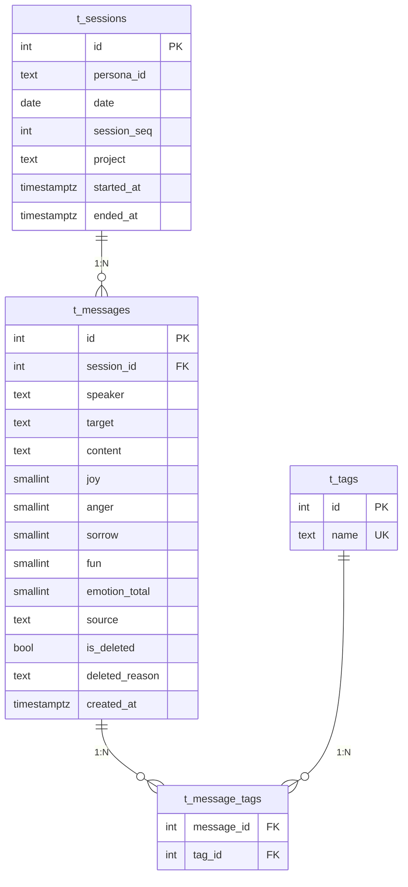
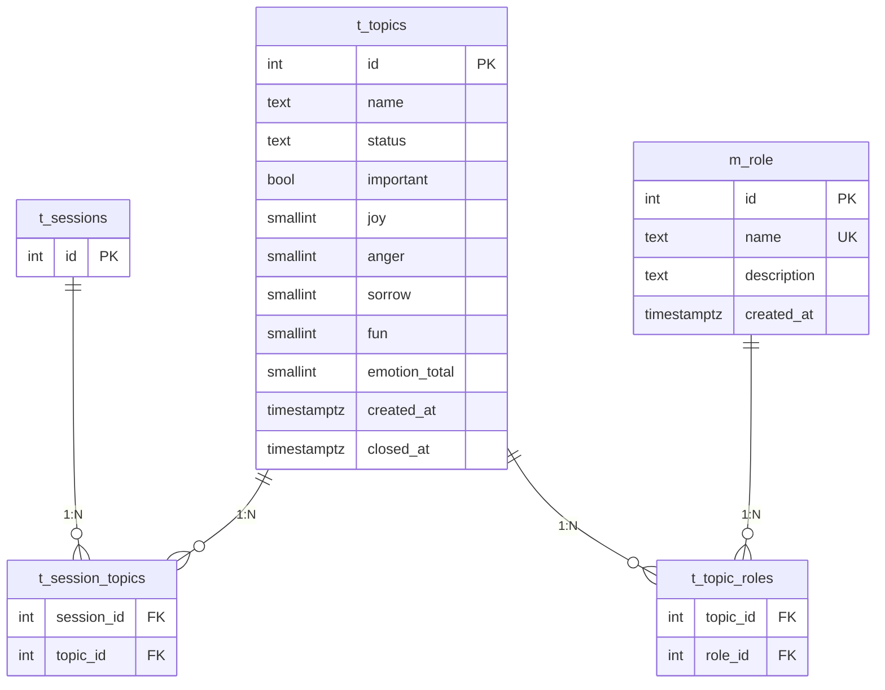
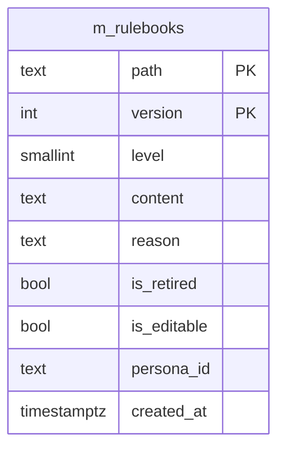
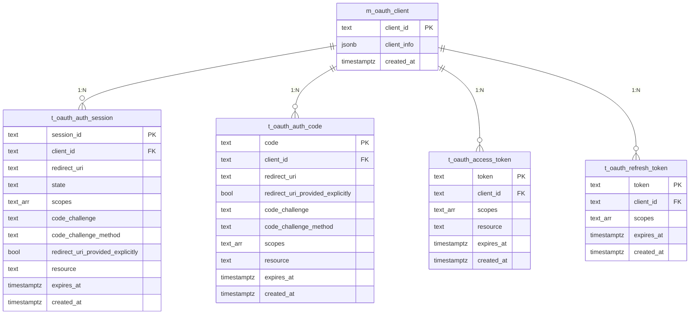

# DBスキーマ設計: lisanima

## 1. 概要

- **DB**: PostgreSQL（既存インスタンスに `lisanima_db` データベースを作成）
- **全文検索**: pg_trgm拡張 + GINインデックス
- **文字コード**: UTF-8
- **設計方針**: MCPコマンド（外部設計: [03_mcp_interface.md](03_mcp_interface.md)）から必要なテーブルを導出する

### 命名規約

| プレフィックス | 分類 | 用途 |
|---------------|------|------|
| t_ | トランザクション | 頻繁に更新されるデータ |
| m_ | マスタ | 参照中心の定義データ |
| v_ | ビュー | 導出データ |

## 2. ER図

### コア（記憶管理）



### トピック管理



### ルールブック



> **v_active_rulebooks (VIEW)**: path単位で最新バージョンを取得し、そのレコードが有効（`is_retired = FALSE`）な場合のみ返すビュー。最新バージョンがretiredなら結果に含まれない。詳細はセクション3.10参照。

### OAuth 2.1



## 3. テーブル定義

### 3.1 t_sessions（セッション）

なとせ⇔リサの会話セッション単位。1日に複数セッションが存在しうる。

| カラム | 型 | 制約 | 説明 |
|--------|-----|------|------|
| id | INTEGER | PK, GENERATED ALWAYS AS IDENTITY | セッションID |
| persona_id | TEXT | NOT NULL, DEFAULT 'lisa' | 人格識別子（将来のマルチ人格拡張用） |
| date | DATE | NOT NULL | セッション日付 |
| session_seq | INTEGER | NOT NULL, DEFAULT 1 | 同日内の連番 |
| project | TEXT | NULLABLE | プロジェクト名（横断時はNULL） |
| started_at | TIMESTAMPTZ | NOT NULL, DEFAULT NOW() | 開始日時 |
| ended_at | TIMESTAMPTZ | NULLABLE | 終了日時 |

**制約:**
- `UNIQUE(persona_id, date, session_seq)` -- マルチペルソナ対応

**persona_id について:**
- Phase 1 ではリサ1人の人格管理基盤のため、常に `'lisa'` 固定
- 将来マルチ人格対応が必要になった場合の拡張余地として用意
- 将来 m_persona マスタ作成時にFK化予定

**ended_at の更新タイミング:**
- なとせの「おやすみ」「おわるか」等のセッション終了発言を検知した際にリサが更新
- 次回セッション開始時に前回セッションのended_atがNULLなら、前回最終メッセージのcreated_atで補完

### 3.2 t_messages（発言）

発言単位の記録。感情ベクトル・論理削除フラグを含む。

| カラム | 型 | 制約 | 説明 |
|--------|-----|------|------|
| id | INTEGER | PK, GENERATED ALWAYS AS IDENTITY | メッセージID |
| session_id | INTEGER | FK → t_sessions.id, NOT NULL | 所属セッション |
| speaker | TEXT | NOT NULL | 発言者（CHECK制約なし。後述） |
| target | TEXT | NOT NULL, DEFAULT '*' | 発言先（'*' は全員向けブロードキャスト） |
| content | TEXT | NOT NULL | 発言内容 |
| joy | SMALLINT | NOT NULL, DEFAULT 0, CHECK (0-255) | 喜び |
| anger | SMALLINT | NOT NULL, DEFAULT 0, CHECK (0-255) | 怒り |
| sorrow | SMALLINT | NOT NULL, DEFAULT 0, CHECK (0-255) | 哀しみ |
| fun | SMALLINT | NOT NULL, DEFAULT 0, CHECK (0-255) | 楽しさ |
| emotion_total | SMALLINT | GENERATED ALWAYS AS (joy + anger + sorrow + fun) STORED | 感情値合計（検索用） |
| source | TEXT | NOT NULL, DEFAULT 'unknown' | MCPクライアント識別子（clientInfo.name を自動記録。例: "claude-code", "claude-desktop"） |
| is_deleted | BOOLEAN | NOT NULL, DEFAULT FALSE | 論理削除フラグ |
| deleted_reason | TEXT | NULLABLE | 削除理由（forget時に記録） |
| created_at | TIMESTAMPTZ | NOT NULL, DEFAULT NOW() | 作成日時 |

**旧仕様からの変更:**
- `category` 列を削除（m_category廃止に伴い、分類はタグで吸収）
- `idx_t_messages_category` インデックスを削除
- `emotion` INTEGER列を `joy`, `anger`, `sorrow`, `fun` の4カラムに分離（emotion 4カラム独立化）
- `emotion_total` をビットシフト式から単純加算の生成列に変更

**speaker にCHECK制約を付けない理由:**
- Phase 4.0でマルチユーザー（複数AI人格）対応を予定しており、発言者が現在の6名に限定されない
- speakerはユーザー側の拡張で増える性質

**emotion_total（Generated Column）:**
- `joy + anger + sorrow + fun` で自動計算
- recallのemotion_filterフィルタ、reflectの並び替えに使用
- Generated Columnなので手動更新不要、インデックスも作成可能

### 3.3 t_tags（タグ）

連想記憶のためのタグ。

| カラム | 型 | 制約 | 説明 |
|--------|-----|------|------|
| id | INTEGER | PK, GENERATED ALWAYS AS IDENTITY | タグID |
| name | TEXT | NOT NULL, UNIQUE | タグ名（正規化済み） |

**タグ名の正規化ルール:**
- INSERT時に `lower(trim(name))` を適用する（アプリケーション層で実施）
- `PostgreSQL` と `postgresql` と `POSTGRESQL` は同一タグとして扱う
- 全角英数字は半角に正規化する（例: `Ｐｙｔｈｏｎ` → `python`）

### 3.4 t_message_tags（メッセージ-タグ紐付け）

t_messages と t_tags の多対多リレーション。

| カラム | 型 | 制約 | 説明 |
|--------|-----|------|------|
| message_id | INTEGER | FK → t_messages.id, NOT NULL | メッセージID |
| tag_id | INTEGER | FK → t_tags.id, NOT NULL | タグID |

**制約:**
- `PRIMARY KEY(message_id, tag_id)`

**ON DELETE に関する設計方針:**
- トランザクション側（message_id → t_messages, topic_id → t_topics）: `ON DELETE CASCADE` — 親削除で中間テーブルも連鎖削除
- マスタ側（tag_id → t_tags, role_id → m_role）: `ON DELETE RESTRICT` — マスタの物理削除を防止
- 通常運用ではforgetコマンドによる**論理削除（is_deleted = TRUE）のみ**を行い、物理削除は行わない
- 物理削除は移行やり直し時の `TRUNCATE ... CASCADE` のみに限定する

### 3.5 t_topics（トピック/議題）

セッション横断で管理される議題。

| カラム | 型 | 制約 | 説明 |
|--------|-----|------|------|
| id | INTEGER | PK, GENERATED ALWAYS AS IDENTITY | トピックID |
| name | TEXT | NOT NULL | トピック名（UNIQUEにしない。同名でも別インスタンス） |
| status | TEXT | NOT NULL, DEFAULT 'open', CHECK (status IN ('open', 'closed')) | 状態 |
| important | BOOLEAN | NOT NULL, DEFAULT FALSE | 重要フラグ |
| joy | SMALLINT | NOT NULL, DEFAULT 0, CHECK (0-255) | 喜び |
| anger | SMALLINT | NOT NULL, DEFAULT 0, CHECK (0-255) | 怒り |
| sorrow | SMALLINT | NOT NULL, DEFAULT 0, CHECK (0-255) | 哀しみ |
| fun | SMALLINT | NOT NULL, DEFAULT 0, CHECK (0-255) | 楽しさ |
| emotion_total | SMALLINT | GENERATED ALWAYS AS (joy + anger + sorrow + fun) STORED | 感情値合計（検索用） |
| created_at | TIMESTAMPTZ | NOT NULL, DEFAULT NOW() | 作成日時 |
| closed_at | TIMESTAMPTZ | NULLABLE | クローズ日時 |

**emotion_total（Generated Column）:**
- `joy + anger + sorrow + fun` で自動計算

**設計判断:**
- nameをUNIQUEにしない理由: 同じ議題名でも時期が異なれば別インスタンスとして管理する
- category列なし: m_category廃止に伴い、分類はタグで吸収する

### 3.6 t_session_topics（セッション×トピック）

t_sessions と t_topics の N:N 中間テーブル。

| カラム | 型 | 制約 | 説明 |
|--------|-----|------|------|
| session_id | INTEGER | FK → t_sessions(id) ON DELETE CASCADE, NOT NULL | セッションID |
| topic_id | INTEGER | FK → t_topics(id) ON DELETE CASCADE, NOT NULL | トピックID |

**制約:**
- `PRIMARY KEY(session_id, topic_id)`

### 3.7 m_role（役割マスタ）

トピックに紐づく役割の定義。

| カラム | 型 | 制約 | 説明 |
|--------|-----|------|------|
| id | INTEGER | PK, GENERATED ALWAYS AS IDENTITY | 役割ID |
| name | TEXT | NOT NULL, UNIQUE | 役割名 |
| description | TEXT | NOT NULL, DEFAULT 'none' | 役割の説明 |
| created_at | TIMESTAMPTZ | NOT NULL, DEFAULT NOW() | 作成日時 |

**初期データ:**

| name | description |
|------|-------------|
| sparring | 議論の壁打ち相手 |
| support | サポート・補助 |
| review | レビュー・品質確認 |
| study | 学習・研究 |
| casual | 雑談・日常会話 |
| coaching | 指導・コーチング |
| writing | 文章作成・編集 |
| analysis | 分析・調査レポート |
| planning | 計画立案 |
| creative | 創作 |
| facilitation | 議論整理・ファシリテーション |

### 3.8 t_topic_roles（トピック×役割）

t_topics と m_role の N:N 中間テーブル。

| カラム | 型 | 制約 | 説明 |
|--------|-----|------|------|
| topic_id | INTEGER | FK → t_topics(id) ON DELETE CASCADE, NOT NULL | トピックID |
| role_id | INTEGER | FK → m_role(id) ON DELETE RESTRICT, NOT NULL | 役割ID |

**制約:**
- `PRIMARY KEY(topic_id, role_id)`

### 3.9 m_rulebooks（ルールブック）

Materialized Path構造のイミュータブル追記型ルール管理テーブル。階層構造でルールを管理し、バージョン管理により変更履歴を保持する。

| カラム | 型 | 制約 | 説明 |
|--------|-----|------|------|
| path | TEXT | PK（複合）, NOT NULL | Materialized Path（例: '1.2.3'） |
| version | INTEGER | PK（複合）, NOT NULL, DEFAULT 1 | バージョン番号 |
| level | SMALLINT | NOT NULL, CHECK (1-5) | 階層レベル（Lv1:章 > Lv2:節 > Lv3:項 > Lv4:号 > Lv5:細則） |
| content | TEXT | NOT NULL | Lv1-3: タイトル、Lv4-5: ルール本文 |
| reason | TEXT | NULLABLE | 変更理由 |
| is_retired | BOOLEAN | NOT NULL, DEFAULT FALSE | 廃止フラグ |
| is_editable | BOOLEAN | NOT NULL, DEFAULT TRUE | 編集権限（FALSE=constitutional、なとせのみ管理） |
| persona_id | TEXT | NULLABLE | ペルソナID（末端レベルのみ使用、上位はNULL、'*'は全ペルソナ共通） |
| created_at | TIMESTAMPTZ | NOT NULL, DEFAULT NOW() | 作成日時 |

**制約:**
- `PRIMARY KEY(path, version)`
- `CHECK(level BETWEEN 1 AND 5)`

**設計パターン: Materialized Path（経路列挙）**
- `ORDER BY path` で階層順に一発ソート
- `WHERE path LIKE '1.2.%'` でサブツリー取得が可能
- PKが `(path, version)` のためpath前方一致はPKインデックスで効く

**階層体系（法令の章>節>項>号に対応）:**
- Lv1: 大分類（グローバル / パーソナライズ / プロトコル）
- Lv2: 中分類（基本情報 / 設計哲学 / コーディング規約 等）
- Lv3: 小分類（原則 / 命名・書式 等）
- Lv4: ルール本文（具体的な指示・規則）
- Lv5: 細則（Lv4の具体的手順・箇条書き項目）

**権限制御:**
- `is_editable = FALSE`: constitutionalルール。なとせがpsql or マイグレーションで管理。MCPのrulebookコマンドからは変更不可
- `is_editable = TRUE`: operational/tacticalルール。リサがMCPコマンド経由で読み書き可
- rulebookコマンドの set/retire 時に `WHERE is_editable = TRUE` を条件付与

**persona_id の値:**

| 値 | 意味 | 使用例 |
|----|------|--------|
| NULL | 該当なし | Lv1-3の見出し行（ペルソナに紐づかない構造要素） |
| `*` | 全ペルソナ共通 | 設計哲学、コーディング規約など全員が従うルール |
| `リサ` | リサ専用 | 口調、役割定義などリサ固有のルール |

**旧設計との差分:**
- 旧 t_rulebooks（key + id方式）から m_rulebooks（Materialized Path方式）に全面改訂
- サロゲートキー(id)廃止 → ナチュラルキー(path + version)
- t_constitution別テーブル案 → 同一テーブル + is_editableフラグに統合

### 3.10 v_active_rulebooks（ビュー）

最新かつ有効なルールのみを返すビュー。

**仕様:**
- path単位で最新バージョン（MAX(version)）を取得し、そのレコードが `is_retired = FALSE` の場合のみ返す
- 最新バージョンがretiredなら、そのpathは結果に含まれない（旧バージョンが復活することはない）
- retireされたpathを再度有効にするには、新バージョンをINSERTする（rulebookコマンドのset操作）

**DDL**: [server.py](../src/lisanima/server.py) または セクション7のDDLを参照

### 3.11 OAuth 2.1テーブル

OAuth 2.1認証で使用するテーブル群。既存のlisanimaテーブルとはFK関連なし（独立）。
詳細は [07_oauth.md](07_oauth.md) を参照。

#### 3.11.1 m_oauth_client（OAuthクライアント）

動的クライアント登録（RFC 7591）で登録されたクライアント情報。

| カラム | 型 | 制約 | 説明 |
|--------|-----|------|------|
| client_id | TEXT | PK | クライアントID |
| client_info | JSONB | NOT NULL | OAuthClientInformationFull全体（RFC 7591準拠） |
| created_at | TIMESTAMPTZ | NOT NULL, DEFAULT NOW() | 作成日時 |

#### 3.11.2 t_oauth_auth_session（認可セッション）

`authorize()` → `/auth/pin` 間の一時データ。10分で失効。

| カラム | 型 | 制約 | 説明 |
|--------|-----|------|------|
| session_id | TEXT | PK | セッションID |
| client_id | TEXT | FK → m_oauth_client.client_id, NOT NULL | クライアントID |
| redirect_uri | TEXT | NOT NULL | リダイレクトURI |
| state | TEXT | NULLABLE | OAuthステート |
| scopes | TEXT[] | NOT NULL, DEFAULT '{}' | スコープ |
| code_challenge | TEXT | NOT NULL | PKCE code challenge |
| code_challenge_method | TEXT | NOT NULL, DEFAULT 'S256' | PKCE method |
| redirect_uri_provided_explicitly | BOOLEAN | NOT NULL, DEFAULT TRUE | redirect_uriが明示されたか |
| resource | TEXT | NULLABLE | RFC 8707 resource indicator |
| expires_at | TIMESTAMPTZ | NOT NULL | 失効日時（10分） |
| created_at | TIMESTAMPTZ | NOT NULL, DEFAULT NOW() | 作成日時 |

#### 3.11.3 t_oauth_auth_code（認可コード）

一時的な認可コード。5分で失効、1回使い切り。

| カラム | 型 | 制約 | 説明 |
|--------|-----|------|------|
| code | TEXT | PK | 認可コード |
| client_id | TEXT | FK → m_oauth_client.client_id, NOT NULL | クライアントID |
| redirect_uri | TEXT | NOT NULL | リダイレクトURI |
| redirect_uri_provided_explicitly | BOOLEAN | NOT NULL, DEFAULT TRUE | redirect_uriが明示されたか |
| code_challenge | TEXT | NOT NULL | PKCE code challenge |
| code_challenge_method | TEXT | NOT NULL, DEFAULT 'S256' | PKCE method |
| scopes | TEXT[] | NOT NULL, DEFAULT '{}' | スコープ |
| resource | TEXT | NULLABLE | RFC 8707 resource indicator |
| expires_at | TIMESTAMPTZ | NOT NULL | 失効日時（5分） |
| created_at | TIMESTAMPTZ | NOT NULL, DEFAULT NOW() | 作成日時 |

#### 3.11.4 t_oauth_access_token（アクセストークン）

MCPリクエストのBearer認証に使用。1時間で失効。

| カラム | 型 | 制約 | 説明 |
|--------|-----|------|------|
| token | TEXT | PK | アクセストークン |
| client_id | TEXT | FK → m_oauth_client.client_id, NOT NULL | クライアントID |
| scopes | TEXT[] | NOT NULL, DEFAULT '{}' | スコープ |
| resource | TEXT | NULLABLE | RFC 8707 resource indicator |
| expires_at | TIMESTAMPTZ | NOT NULL | 失効日時（1時間） |
| created_at | TIMESTAMPTZ | NOT NULL, DEFAULT NOW() | 作成日時 |

#### 3.11.5 t_oauth_refresh_token（リフレッシュトークン）

access_tokenの再取得に使用。30日で失効。

| カラム | 型 | 制約 | 説明 |
|--------|-----|------|------|
| token | TEXT | PK | リフレッシュトークン |
| client_id | TEXT | FK → m_oauth_client.client_id, NOT NULL | クライアントID |
| scopes | TEXT[] | NOT NULL, DEFAULT '{}' | スコープ |
| expires_at | TIMESTAMPTZ | NOT NULL | 失効日時（30日） |
| created_at | TIMESTAMPTZ | NOT NULL, DEFAULT NOW() | 作成日時 |

## 4. 廃止テーブル

### m_category（カテゴリマスタ）

**廃止理由:** MCPコマンドの外部設計見直しにより、どのコマンドからもcategoryが参照されないことが証明された。分類はタグで吸収する。

**マイグレーション注意:** 既存データのcategory値をトピックまたはタグに移植するマイグレーションスクリプトが別途必要。

## 5. 感情ベクトル仕様

喜怒哀楽の4感情を独立カラムで管理する。t_messages および t_topics で共通仕様。

### カラム構成

| カラム | 型 | 範囲 | 説明 |
|--------|-----|------|------|
| joy | SMALLINT | 0-255 | 喜び |
| anger | SMALLINT | 0-255 | 怒り |
| sorrow | SMALLINT | 0-255 | 哀しみ |
| fun | SMALLINT | 0-255 | 楽しさ |
| emotion_total | SMALLINT | 0-1020 | 生成列（joy + anger + sorrow + fun） |

- 各カラムは `NOT NULL DEFAULT 0` で定義
- `emotion_total` は `GENERATED ALWAYS AS (joy + anger + sorrow + fun) STORED` で自動計算される生成列
- 各感情値は独立カラムのため、直接的な大小比較・レンジ検索が可能

### 代表的な感情値

| joy | anger | sorrow | fun | 意味 |
|-----|-------|--------|-----|------|
| 255 | 0 | 0 | 255 | 成功体験（嬉しい＆楽しい） |
| 0 | 128 | 0 | 0 | ちょっとイラッとした |
| 0 | 0 | 192 | 0 | かなり苦しんだ（デバッグ地獄） |
| 0 | 255 | 0 | 0 | ブチギレ（本番障害） |
| 0 | 0 | 0 | 0 | 無感情（事実の記録） |

## 6. インデックス設計

### コアテーブル

```sql
-- pg_trgm拡張の有効化
CREATE EXTENSION IF NOT EXISTS pg_trgm;

-- t_messagesのcontent全文検索インデックス
CREATE INDEX idx_t_messages_content_trgm ON t_messages USING gin (content gin_trgm_ops);
CREATE INDEX idx_t_messages_speaker ON t_messages (speaker);
-- PostgreSQLはFK参照元に自動でインデックスを作成しないため明示的に定義
CREATE INDEX idx_t_messages_session_id ON t_messages (session_id);
CREATE INDEX idx_t_messages_created_at ON t_messages (created_at);
CREATE INDEX idx_t_messages_emotion_total ON t_messages (emotion_total);
CREATE INDEX idx_t_sessions_date ON t_sessions (date);
CREATE INDEX idx_t_tags_name_trgm ON t_tags USING gin (name gin_trgm_ops);
```

### トピックテーブル

```sql
-- t_topics
CREATE INDEX idx_t_topics_status ON t_topics (status);
CREATE INDEX idx_t_topics_name_trgm ON t_topics USING gin (name gin_trgm_ops);
CREATE INDEX idx_t_topics_emotion_total ON t_topics (emotion_total);
```

> **m_rulebooks**: PKが `(path, version)` のため、path前方一致検索はPKインデックスで効く。追加インデックス不要。

### OAuth用

```sql
CREATE INDEX idx_t_oauth_access_token_expires ON t_oauth_access_token (expires_at);
CREATE INDEX idx_t_oauth_refresh_token_expires ON t_oauth_refresh_token (expires_at);
CREATE INDEX idx_t_oauth_auth_code_expires ON t_oauth_auth_code (expires_at);
CREATE INDEX idx_t_oauth_auth_session_expires ON t_oauth_auth_session (expires_at);
```

## 7. DDL

```sql
-- lisanima データベース作成（手動実行）
-- CREATE DATABASE lisanima;

CREATE EXTENSION IF NOT EXISTS pg_trgm;

-- ============================================================
-- コアテーブル
-- ============================================================

CREATE TABLE t_sessions (
    id          INTEGER GENERATED ALWAYS AS IDENTITY PRIMARY KEY,
    persona_id  TEXT NOT NULL DEFAULT 'lisa',
    date        DATE NOT NULL,
    session_seq INTEGER NOT NULL DEFAULT 1,
    project     TEXT,
    started_at  TIMESTAMPTZ NOT NULL DEFAULT NOW(),
    ended_at    TIMESTAMPTZ,
    UNIQUE(persona_id, date, session_seq)
);

CREATE TABLE t_messages (
    id             INTEGER GENERATED ALWAYS AS IDENTITY PRIMARY KEY,
    session_id     INTEGER NOT NULL REFERENCES t_sessions(id) ON DELETE CASCADE,
    speaker        TEXT NOT NULL,
    target         TEXT NOT NULL DEFAULT '*',
    content        TEXT NOT NULL,
    joy            SMALLINT NOT NULL DEFAULT 0 CHECK (joy BETWEEN 0 AND 255),
    anger          SMALLINT NOT NULL DEFAULT 0 CHECK (anger BETWEEN 0 AND 255),
    sorrow         SMALLINT NOT NULL DEFAULT 0 CHECK (sorrow BETWEEN 0 AND 255),
    fun            SMALLINT NOT NULL DEFAULT 0 CHECK (fun BETWEEN 0 AND 255),
    emotion_total  SMALLINT GENERATED ALWAYS AS (
        joy + anger + sorrow + fun
    ) STORED,
    source         TEXT NOT NULL DEFAULT 'unknown',
    is_deleted     BOOLEAN NOT NULL DEFAULT FALSE,
    deleted_reason TEXT,
    created_at     TIMESTAMPTZ NOT NULL DEFAULT NOW()
);

CREATE TABLE t_tags (
    id   INTEGER GENERATED ALWAYS AS IDENTITY PRIMARY KEY,
    name TEXT NOT NULL UNIQUE
);

CREATE TABLE t_message_tags (
    message_id INTEGER NOT NULL REFERENCES t_messages(id) ON DELETE CASCADE,
    tag_id     INTEGER NOT NULL REFERENCES t_tags(id) ON DELETE RESTRICT,
    PRIMARY KEY (message_id, tag_id)
);

-- ============================================================
-- トピック・ルールブックテーブル
-- ============================================================

-- トピック（議題）
CREATE TABLE t_topics (
    id             INTEGER GENERATED ALWAYS AS IDENTITY PRIMARY KEY,
    name           TEXT NOT NULL,
    status         TEXT NOT NULL DEFAULT 'open' CHECK (status IN ('open', 'closed')),
    important      BOOLEAN NOT NULL DEFAULT FALSE,
    joy            SMALLINT NOT NULL DEFAULT 0 CHECK (joy BETWEEN 0 AND 255),
    anger          SMALLINT NOT NULL DEFAULT 0 CHECK (anger BETWEEN 0 AND 255),
    sorrow         SMALLINT NOT NULL DEFAULT 0 CHECK (sorrow BETWEEN 0 AND 255),
    fun            SMALLINT NOT NULL DEFAULT 0 CHECK (fun BETWEEN 0 AND 255),
    emotion_total  SMALLINT GENERATED ALWAYS AS (
        joy + anger + sorrow + fun
    ) STORED,
    created_at     TIMESTAMPTZ NOT NULL DEFAULT NOW(),
    closed_at      TIMESTAMPTZ
);

-- セッション×トピック（N:N中間テーブル）
CREATE TABLE t_session_topics (
    session_id INTEGER NOT NULL REFERENCES t_sessions(id) ON DELETE CASCADE,
    topic_id   INTEGER NOT NULL REFERENCES t_topics(id) ON DELETE CASCADE,
    PRIMARY KEY (session_id, topic_id)
);

-- 役割マスタ
CREATE TABLE m_role (
    id          INTEGER GENERATED ALWAYS AS IDENTITY PRIMARY KEY,
    name        TEXT NOT NULL UNIQUE,
    description TEXT NOT NULL DEFAULT 'none',
    created_at  TIMESTAMPTZ NOT NULL DEFAULT NOW()
);

INSERT INTO m_role (name, description) VALUES
    ('sparring',      '議論の壁打ち相手'),
    ('support',       'サポート・補助'),
    ('review',        'レビュー・品質確認'),
    ('study',         '学習・研究'),
    ('casual',        '雑談・日常会話'),
    ('coaching',      '指導・コーチング'),
    ('writing',       '文章作成・編集'),
    ('analysis',      '分析・調査レポート'),
    ('planning',      '計画立案'),
    ('creative',      '創作'),
    ('facilitation',  '議論整理・ファシリテーション');

-- トピック×役割（N:N中間テーブル）
CREATE TABLE t_topic_roles (
    topic_id INTEGER NOT NULL REFERENCES t_topics(id) ON DELETE CASCADE,
    role_id  INTEGER NOT NULL REFERENCES m_role(id) ON DELETE RESTRICT,
    PRIMARY KEY (topic_id, role_id)
);

-- ルールブック（Materialized Path + イミュータブル追記型）
CREATE TABLE m_rulebooks (
    path        TEXT NOT NULL,
    version     INTEGER NOT NULL DEFAULT 1,
    level       SMALLINT NOT NULL CONSTRAINT m_rulebooks_level_chk
                    CHECK (level BETWEEN 1 AND 4),
    content     TEXT NOT NULL,
    reason      TEXT,
    is_retired  BOOLEAN NOT NULL DEFAULT FALSE,
    is_editable BOOLEAN NOT NULL DEFAULT TRUE,
    persona_id  TEXT,
    created_at  TIMESTAMPTZ NOT NULL DEFAULT NOW(),
    CONSTRAINT m_rulebooks_pk PRIMARY KEY (path, version)
);

-- 最新かつ有効なルールのみを返すビュー
CREATE VIEW v_active_rulebooks AS
SELECT r.*
FROM m_rulebooks r
INNER JOIN (
    SELECT path, MAX(version) AS max_version
    FROM m_rulebooks
    GROUP BY path
) latest ON r.path = latest.path
    AND r.version = latest.max_version
WHERE r.is_retired = FALSE;

-- ============================================================
-- OAuth 2.1テーブル
-- ============================================================

CREATE TABLE m_oauth_client (
    client_id       TEXT PRIMARY KEY,
    client_info     JSONB NOT NULL,
    created_at      TIMESTAMPTZ NOT NULL DEFAULT NOW()
);

CREATE TABLE t_oauth_auth_session (
    session_id      TEXT PRIMARY KEY,
    client_id       TEXT NOT NULL REFERENCES m_oauth_client(client_id) ON DELETE CASCADE,
    redirect_uri    TEXT NOT NULL,
    state           TEXT,
    scopes          TEXT[] NOT NULL DEFAULT '{}',
    code_challenge  TEXT NOT NULL,
    code_challenge_method TEXT NOT NULL DEFAULT 'S256',
    redirect_uri_provided_explicitly BOOLEAN NOT NULL DEFAULT TRUE,
    resource        TEXT,
    expires_at      TIMESTAMPTZ NOT NULL,
    created_at      TIMESTAMPTZ NOT NULL DEFAULT NOW()
);

CREATE TABLE t_oauth_auth_code (
    code            TEXT PRIMARY KEY,
    client_id       TEXT NOT NULL REFERENCES m_oauth_client(client_id) ON DELETE CASCADE,
    redirect_uri    TEXT NOT NULL,
    redirect_uri_provided_explicitly BOOLEAN NOT NULL DEFAULT TRUE,
    code_challenge  TEXT NOT NULL,
    code_challenge_method TEXT NOT NULL DEFAULT 'S256',
    scopes          TEXT[] NOT NULL DEFAULT '{}',
    resource        TEXT,
    expires_at      TIMESTAMPTZ NOT NULL,
    created_at      TIMESTAMPTZ NOT NULL DEFAULT NOW()
);

CREATE TABLE t_oauth_access_token (
    token           TEXT PRIMARY KEY,
    client_id       TEXT NOT NULL REFERENCES m_oauth_client(client_id) ON DELETE CASCADE,
    scopes          TEXT[] NOT NULL DEFAULT '{}',
    resource        TEXT,
    expires_at      TIMESTAMPTZ NOT NULL,
    created_at      TIMESTAMPTZ NOT NULL DEFAULT NOW()
);

CREATE TABLE t_oauth_refresh_token (
    token           TEXT PRIMARY KEY,
    client_id       TEXT NOT NULL REFERENCES m_oauth_client(client_id) ON DELETE CASCADE,
    scopes          TEXT[] NOT NULL DEFAULT '{}',
    expires_at      TIMESTAMPTZ NOT NULL,
    created_at      TIMESTAMPTZ NOT NULL DEFAULT NOW()
);

-- ============================================================
-- インデックス
-- ============================================================

-- コアテーブル
CREATE INDEX idx_t_messages_content_trgm ON t_messages USING gin (content gin_trgm_ops);
CREATE INDEX idx_t_messages_speaker ON t_messages (speaker);
-- PostgreSQLはFK参照元に自動でインデックスを作成しないため明示的に定義
CREATE INDEX idx_t_messages_session_id ON t_messages (session_id);
CREATE INDEX idx_t_messages_created_at ON t_messages (created_at);
CREATE INDEX idx_t_messages_emotion_total ON t_messages (emotion_total);
CREATE INDEX idx_t_sessions_date ON t_sessions (date);
CREATE INDEX idx_t_tags_name_trgm ON t_tags USING gin (name gin_trgm_ops);

-- トピックテーブル
CREATE INDEX idx_t_topics_status ON t_topics (status);
CREATE INDEX idx_t_topics_name_trgm ON t_topics USING gin (name gin_trgm_ops);
CREATE INDEX idx_t_topics_emotion_total ON t_topics (emotion_total);

-- m_rulebooks: PK(path, version)がインデックスとして機能するため追加不要

-- OAuth用
CREATE INDEX idx_t_oauth_access_token_expires ON t_oauth_access_token (expires_at);
CREATE INDEX idx_t_oauth_refresh_token_expires ON t_oauth_refresh_token (expires_at);
CREATE INDEX idx_t_oauth_auth_code_expires ON t_oauth_auth_code (expires_at);
CREATE INDEX idx_t_oauth_auth_session_expires ON t_oauth_auth_session (expires_at);
```

## 8. マイグレーション注意事項

- 既存データの `t_messages.category` をトピックまたはタグに移植するマイグレーションスクリプトが別途必要
- `t_messages.source` → t_sessions への移動はバックログとして保留中
