# 10. クラス図

## 1. 概要

本ドキュメントは lisanima の Python コード側のクラス構造を Mermaid クラス図で記述する。
アーキテクチャの全体像は [02_architecture.md](./02_architecture.md) を参照。

### 読み方

- **実線矢印 (`-->`)**: 依存関係（uses / imports）
- **点線矢印 (`..|>`)**: Protocol 実装
- **`<<module>>`**: 関数ベースモジュール（クラスを持たず、モジュールレベル関数で構成）
- **`<<dataclass>>`**: Python dataclass
- **`<<singleton>>`**: モジュールレベルでインスタンスが1つだけ生成されるクラス
- レイヤーは上から MCP Interface → Auth → Repository → Database の順に依存する

## 2. 全体クラス図

```mermaid
classDiagram
    direction TB

    %% ============================================================
    %% MCP Interface Layer
    %% ============================================================
    namespace MCPInterfaceLayer {
        class server["server.py"] {
            <<module>>
            +mcp : FastMCP
            +main()
            +lifespan(server) AsyncIterator
            -_parseArgs() Namespace
            -_createMcp() FastMCP
        }

        class remember_tool["tools/remember.py"] {
            <<module>>
            +remember(content, speaker, ...) dict
            -_validateParams(content, speaker, ...) tuple
        }

        class recall_tool["tools/recall.py"] {
            <<module>>
            +recall(query, tags, ...) dict
            -_validateParams(limit, offset, ...) tuple
        }
    }

    %% ============================================================
    %% Auth Layer
    %% ============================================================
    namespace AuthLayer {
        class LisanimaOAuthProvider {
            +get_client(client_id) OAuthClientInformationFull?
            +register_client(client_info)
            +authorize(client, params) str
            +load_authorization_code(client, code) AuthorizationCode?
            +exchange_authorization_code(client, code) OAuthToken
            +load_refresh_token(client, token) RefreshToken?
            +exchange_refresh_token(client, token, scopes) OAuthToken
            +load_access_token(token) AccessToken?
            +revoke_token(token)
        }

        class AuthorizationCode {
            <<dataclass>>
            +code : str
            +client_id : str
            +redirect_uri : str
            +redirect_uri_provided_explicitly : bool
            +code_challenge : str
            +code_challenge_method : str
            +scopes : list~str~
            +expires_at : float
            +resource : str?
        }

        class RefreshToken {
            <<dataclass>>
            +token : str
            +client_id : str
            +scopes : list~str~
            +expires_at : float
        }

        class AccessToken {
            <<dataclass>>
            +token : str
            +client_id : str
            +scopes : list~str~
            +expires_at : float
            +resource : str?
        }

        class pin["auth/pin.py"] {
            <<module>>
            +handlePinGet(request) Response
            +handlePinPost(request) Response
            -_loadTemplate() str
            -_getPinHash() str
            -_verifyPin(pin) bool
            -_checkLockout() bool
            -_recordFailure()
            -_resetFailures()
        }
    }

    %% ============================================================
    %% Repository Layer
    %% ============================================================
    namespace RepositoryLayer {
        class message_repo["repositories/message_repo.py"] {
            <<module>>
            +insertMessage(conn, ...) dict
            +searchMessages(conn, ...) dict
            +encodeEmotion(joy, anger, sorrow, fun) int
            +decodeEmotion(emotion) dict
            -_getMessageTagsBatch(conn, ids) dict
        }

        class session_repo["repositories/session_repo.py"] {
            <<module>>
            +findOrCreateSession(conn, date, ...) dict
            +endSession(conn, session_id) dict?
        }

        class tag_repo["repositories/tag_repo.py"] {
            <<module>>
            +findOrCreateTags(conn, tag_names) list
            +linkMessageTags(conn, message_id, tag_ids)
            +normalizeTagName(name) str
        }

        class oauth_repo["repositories/oauth_repo.py"] {
            <<module>>
            +saveClient(conn, client_id, json)
            +loadClient(conn, client_id) str?
            +saveAuthSession(conn, ...) str
            +loadAuthSession(conn, session_id) dict?
            +deleteAuthSession(conn, session_id)
            +saveAuthCode(conn, ...) str
            +loadAuthCode(conn, code) dict?
            +deleteAuthCode(conn, code)
            +saveAccessToken(conn, ...) tuple
            +loadAccessToken(conn, token) dict?
            +deleteAccessToken(conn, token)
            +saveRefreshToken(conn, ...) str
            +loadRefreshToken(conn, token) dict?
            +deleteRefreshToken(conn, token)
            +deleteAccessTokensByClientId(conn, client_id)
            +deleteRefreshTokensByClientId(conn, client_id)
            +cleanupExpiredTokens(conn) dict
        }
    }

    %% ============================================================
    %% Database Layer
    %% ============================================================
    namespace DatabaseLayer {
        class AsyncDatabasePool {
            <<singleton>>
            -_pool : AsyncConnectionPool?
            +open()
            +close()
            +get_connection() AsyncContextManager
        }
    }

    %% ============================================================
    %% External Libraries（簡略表示）
    %% ============================================================
    class FastMCP {
        <<external>>
    }
    class OAuthAuthorizationServerProvider {
        <<Protocol>>
    }
    class AsyncConnectionPool {
        <<external: psycopg3>>
    }
    class bcrypt {
        <<external>>
    }

    %% ============================================================
    %% 依存関係
    %% ============================================================

    %% MCP Interface → Tools
    server --> remember_tool : registers
    server --> recall_tool : registers
    server --> AsyncDatabasePool : lifespan管理

    %% MCP Interface → Auth（HTTPモードのみ）
    server --> LisanimaOAuthProvider : creates
    server --> pin : routes /auth/pin

    %% Tools → Repository
    remember_tool --> session_repo : uses
    remember_tool --> message_repo : uses
    remember_tool --> tag_repo : uses
    remember_tool --> AsyncDatabasePool : get_connection
    recall_tool --> message_repo : uses
    recall_tool --> AsyncDatabasePool : get_connection

    %% Auth → Repository
    LisanimaOAuthProvider --> oauth_repo : uses
    LisanimaOAuthProvider --> AsyncDatabasePool : get_connection
    pin --> oauth_repo : uses
    pin --> AsyncDatabasePool : get_connection
    pin --> bcrypt : verifyPin

    %% Provider creates dataclasses
    LisanimaOAuthProvider --> AuthorizationCode : creates
    LisanimaOAuthProvider --> RefreshToken : creates
    LisanimaOAuthProvider --> AccessToken : creates

    %% Protocol実装
    LisanimaOAuthProvider ..|> OAuthAuthorizationServerProvider : implements

    %% Database Layer → External
    AsyncDatabasePool --> AsyncConnectionPool : wraps

    %% Server → External
    server --> FastMCP : creates instance
```

## 3. レイヤー別詳細

### MCP Interface Layer

| モジュール | 責務 |
|-----------|------|
| `server.py` | FastMCP インスタンス生成、ツール登録（`@mcp.tool()`）、lifespan によるDBプール管理、HTTPモード時の OAuth/PIN ルート設定 |
| `tools/remember.py` | remember ツールの実装。入力バリデーション → セッション取得 → メッセージ保存 → タグ紐付けを1トランザクションで実行 |
| `tools/recall.py` | recall ツールの実装。入力バリデーション → メッセージ検索 → datetime 変換を実行 |

MCPツールのインターフェース仕様は [03_mcp_interface.md](./03_mcp_interface.md) を参照。

### Auth Layer

| クラス/モジュール | 責務 |
|------------------|------|
| `LisanimaOAuthProvider` | FastMCP の `OAuthAuthorizationServerProvider` Protocol を実装。クライアント管理・認可・トークン発行/検証/無効化の全操作を提供 |
| `AuthorizationCode` | 認可コードのドメインオブジェクト。FastMCP の TokenHandler が `expires_at`, `client_id` 等を参照 |
| `RefreshToken` | リフレッシュトークンのドメインオブジェクト |
| `AccessToken` | アクセストークンのドメインオブジェクト。FastMCP の BearerAuthBackend が `expires_at` を参照 |
| `auth/pin.py` | PIN 認証エンドポイント。ブルートフォース対策（5回失敗で30秒ロックアウト）を含む |

OAuth 認証の詳細は [07_oauth.md](./07_oauth.md) を参照。

### Repository Layer

| モジュール | 責務 | 対応テーブル |
|-----------|------|-------------|
| `message_repo.py` | メッセージの INSERT / 検索。感情ベクトルのエンコード/デコード、pg_trgm による類似検索 | `messages`, `message_tags`, `tags` |
| `session_repo.py` | セッションの取得/作成（日付単位）。`FOR UPDATE` による競合防止 | `sessions` |
| `tag_repo.py` | タグの UPSERT、メッセージ-タグ紐付け。NFKC 正規化 | `tags`, `message_tags` |
| `oauth_repo.py` | OAuth 関連テーブルの全 CRUD。トークン生成、有効期限管理、期限切れ一括削除 | `m_oauth_client`, `t_oauth_auth_session`, `t_oauth_auth_code`, `t_oauth_access_token`, `t_oauth_refresh_token` |

スキーマ定義は [04_schema.md](./04_schema.md) を参照。

### Database Layer

| クラス | 責務 |
|--------|------|
| `AsyncDatabasePool` | psycopg3 の `AsyncConnectionPool` をラップするシングルトン。lazy init 対応（OAuth エンドポイントが MCP セッション確立前にアクセスされるため） |

## 4. 設計ノート

### Protocol 実装パターン

`LisanimaOAuthProvider` は FastMCP が定義する `OAuthAuthorizationServerProvider` Protocol を実装する。
Python の Protocol（構造的部分型）により、明示的な継承なしにインターフェース適合を実現している。
FastMCP 側が要求する属性（`expires_at: float` 等）を持つ dataclass を返すことで、型チェックを通過する。

### 関数ベースモジュールの採用理由

Repository Layer および Tools Layer は関数ベースモジュール（`<<module>>` ステレオタイプ）で構成している。

- **ステートレス**: Repository 関数は DB 接続を引数で受け取り、内部状態を持たない。クラスにする必然性がない
- **テスト容易性**: 関数単位でモック差し替えが容易
- **認知負荷の低減**: `message_repo.insertMessage(conn, ...)` のように「モジュール名.関数名」で十分に意味が伝わる

`AsyncDatabasePool` のみ、接続プールのライフサイクル管理（open/close）と lazy init のために状態を持つクラスとして設計している。

### シングルトンパターン

`AsyncDatabasePool` はモジュールレベルで `db_pool = AsyncDatabasePool()` として1インスタンスを生成する。
DI コンテナは導入せず、モジュールインポートによるシングルトンで十分と判断した（Rule of Three）。
