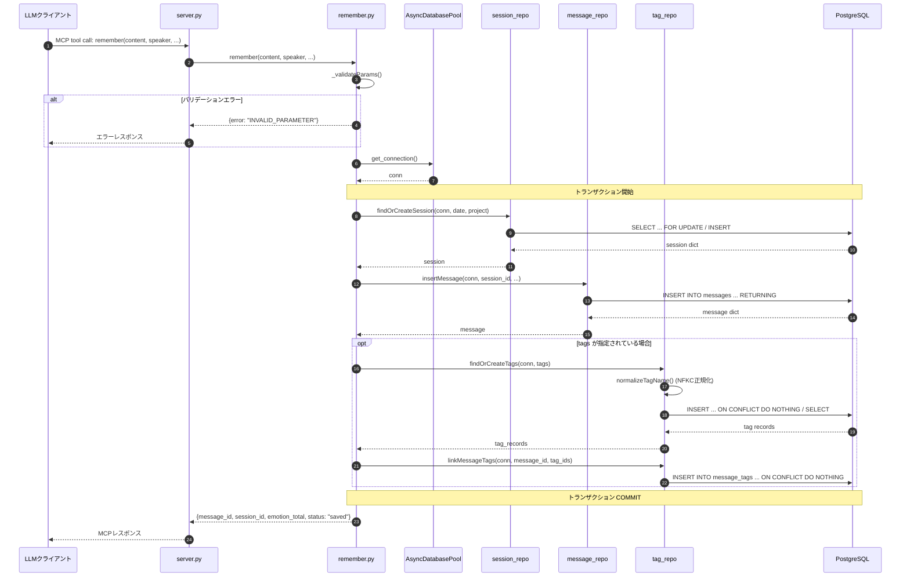
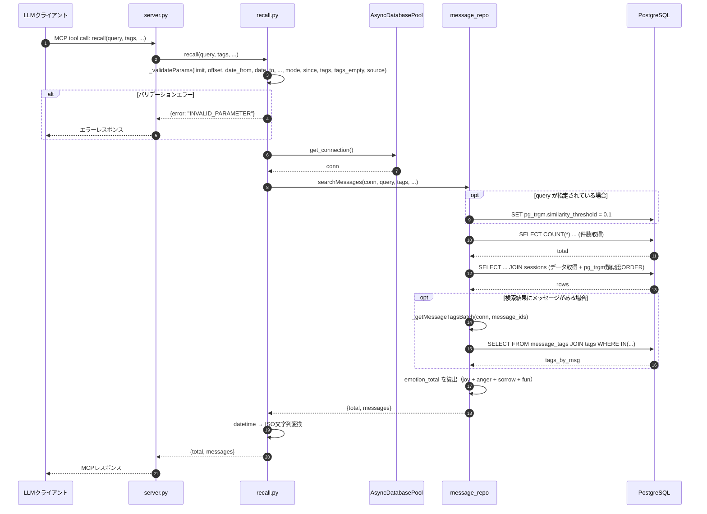
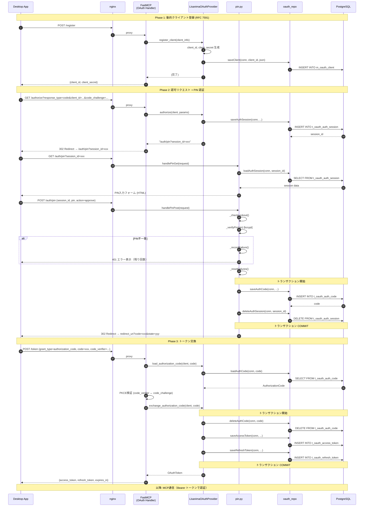

# 11. シーケンス図

## 1. 概要

本ドキュメントは lisanima の主要な処理フローを Mermaid シーケンス図で記述する。
クラス構造は [10_class_diagram.md](./10_class_diagram.md)、トランザクション境界の設計方針は [09_transaction.md](./09_transaction.md) を参照。

対象フローは以下の3本。

| # | フロー | 系統 |
|---|--------|------|
| 1 | remember | 書き込み系代表 |
| 2 | recall | 読み取り系代表 |
| 3 | OAuth 認証 | 認証フロー全体 |

## 2. remember シーケンス図

記憶の保存フロー。セッション取得 → メッセージ保存 → タグ紐付けを **1トランザクション** で実行する。
ツールインターフェースの詳細は [03_mcp_interface.md](./03_mcp_interface.md) を参照。

### 補足

- `findOrCreateSession` は `FOR UPDATE` によるロックで並行リクエスト時の競合を防止する（詳細: [09_transaction.md](./09_transaction.md)）
- emotion は4カラム独立化済み（#9）。エンコード/デコード処理は不要
- エラー発生時はトランザクションが自動ロールバックされ、エラーレスポンスを返す

## 3. recall シーケンス図

記憶の検索フロー。動的 WHERE 構築 → pg_trgm 類似検索 → タグ一括取得の流れ。
スキーマ定義は [04_schema.md](./04_schema.md) を参照。

### 補足

- recall はデータ変更を伴わないため、明示的なトランザクション制御は行わない（autocommit=False のため暗黙トランザクション内で実行）
- タグの一括取得（`_getMessageTagsBatch`）により N+1 問題を回避している
- pg_trgm の `%` 演算子で GIN インデックスを活用（similarity_threshold=0.1 で日本語短文に対応）

## 4. OAuth 認証フロー シーケンス図

Desktop App からリモート接続する際の OAuth 2.1 認証フロー全体。
DCR（動的クライアント登録）→ 認可 → PIN 認証 → トークン交換の一連の流れ。
OAuth 実装の詳細は [07_oauth.md](./07_oauth.md)、セキュリティ要件は [06_security.md](./06_security.md) を参照。

### 補足

- PKCE 検証（`code_verifier` と `code_challenge` の照合）は FastMCP 内部で実行される
- 認可コードは1回使い切り（交換時に即削除）
- PIN 認証はブルートフォース対策として、5回失敗で30秒のロックアウトを実施（インメモリカウンタ）
- nginx のプロキシ構成については [07_oauth.md](./07_oauth.md) を参照

## 5. トランザクション境界の注記

各フローのトランザクション境界は以下の方針に基づく。詳細は [09_transaction.md](./09_transaction.md) を参照。

| フロー | トランザクション範囲 | 理由 |
|--------|---------------------|------|
| remember | セッション取得〜メッセージ保存〜タグ紐付け | 途中失敗時に中途半端なデータが残ることを防ぐ |
| recall | 明示的トランザクションなし | 参照のみ。暗黙トランザクション（autocommit=False）で十分 |
| OAuth: PIN認証 | 認可コード保存〜セッション削除 | 認可コード発行とセッション削除を原子的に実行 |
| OAuth: トークン交換 | 認可コード削除〜AT発行〜RT発行 | 1回使い切りの認可コード削除とトークンペア発行を原子的に実行 |
| OAuth: トークン無効化 | AT削除〜同一クライアントのRT削除（またはその逆） | RFC 7009 推奨: 関連トークンのペア削除を原子的に実行 |
